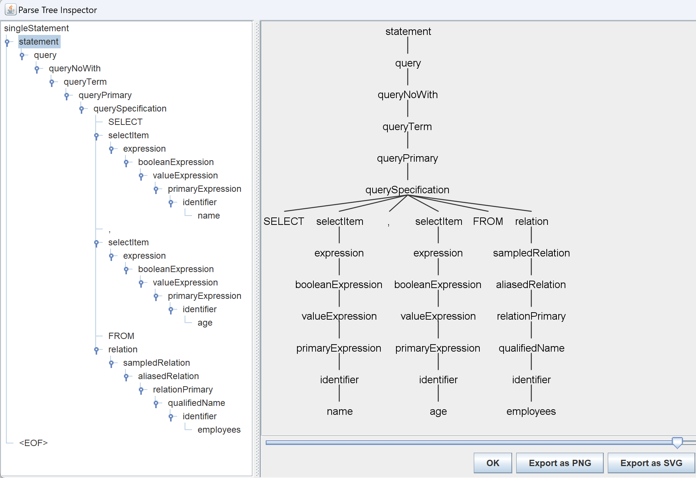

# Antlr-Sql-Csv
简化
1. 限定的查询语句。
2. 以csv作为查询的数据源。

预期效果
```bash
>> select City, State from cities;
...(show result)
>> select name, age from employees;
...(show result)
```

# 步骤
1. [antlr-maven-plugin](https://www.antlr.org/api/maven-plugin/latest/antlr4-mojo.html)解析g4文件
> OutputDirectory的默认值是${project.build.directory}/generated-sources/antlr4
> 在src目录中的文件刚好是vscode插件生成的，所以就不修改默认值了。
```xml
    <build>
        <plugins>
            <plugin>
                <groupId>org.antlr</groupId>
                <artifactId>antlr4-maven-plugin</artifactId>
                <version>4.3</version>
                <executions>
                    <execution>
                        <id>antlr</id>
                        <goals>
                            <goal>antlr4</goal>
                        </goals>
                    </execution>
                </executions>
                <configuration>
                    <arguments>
                        <argument>-visitor</argument>
                        <argument>-no-listener</argument>
                        <argument>-package</argument>
                        <argument>com.example.antlr4</argument>
                    </arguments>
                    <sourceDirectory>${basedir}/src/main/java/com/example/antlr4</sourceDirectory>
                    <treeWarningsAsErrors>true</treeWarningsAsErrors>
                </configuration>
            </plugin>
        </plugins>
    </build>
```
> 补充：TestRig
```bash
demo > java -cp "D:/component/antlr/antlr-4.13.0-complete.jar;target/classes" org.antlr.v4.gui.TestRig com.example.antlr4.SqlBase singleStatement -gui
SELECT name, age FROM employees
^Z
```


2. TODO: 基于Visitor模式处理业务逻辑